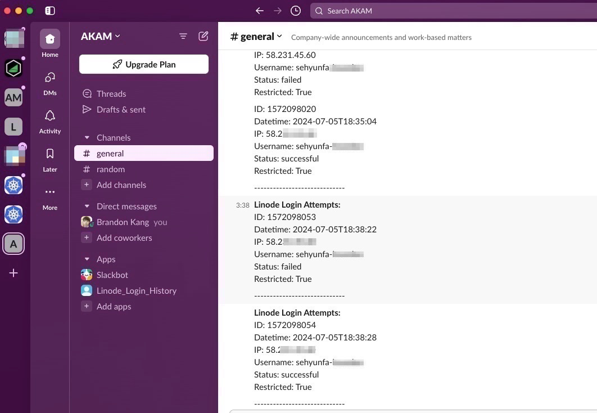
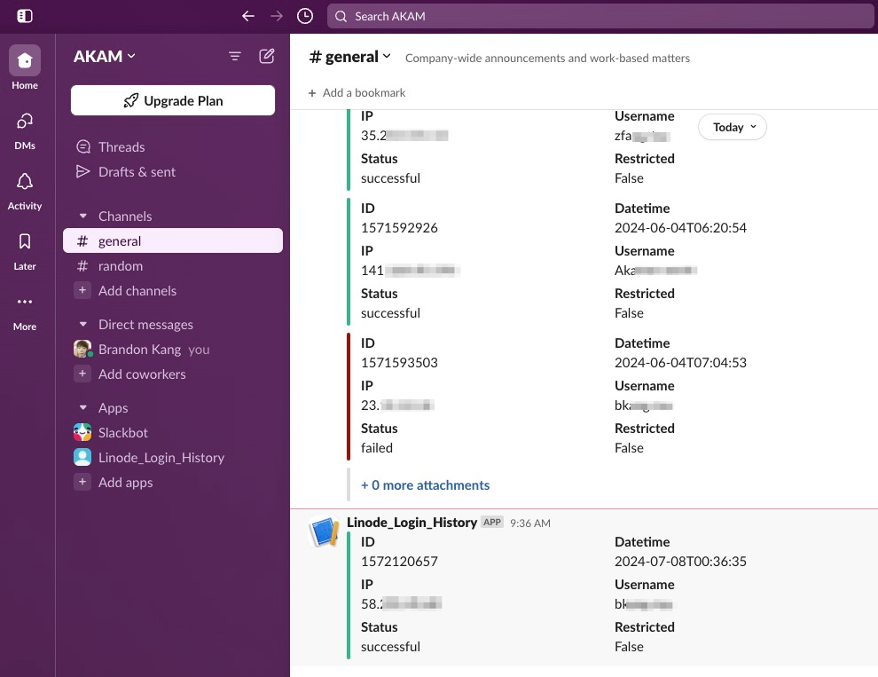

# akamaicloud-login
Receive Akamai Cloud(Linode) login events via Slack Channel. 
Linode Logins API returns a collection of successful logins for all users on the account during the last 90 days.  
More API information: https://techdocs.akamai.com/linode-api/reference/get-account-logins

# Basic Version
This script periodically fetches login attempts from the Linode API and sends notifications to a specified Slack channel. It uses the schedule library to run the fetch_and_send_logins function every 30 seconds.  

This function calls the Linode API to retrieve login attempts, filters new logins since the last call, and sends a formatted message with the login details to Slack using a webhook URL. The script runs indefinitely, continuously checking for new login attempts and posting them to Slack.  

# Advanced Version
Differences from the basic version:

**Message Formatting**  
The advanced version uses Slack's block kit for message formatting, creating more structured and visually appealing messages. 
Each login attempt is represented as a block with fields, and a divider is added between entries.
The previous code sends a simple text message without advanced formatting.

**Conditional Coloring**  
The advanced version includes a color indicator for each login attempt based on the status (successful or not), though the color is set but not actually applied in the blocks.

**Error Handling**  
The advanced version attempts to print the response JSON if the message posting fails and includes a JSON decode error handling, which the previous code lacks.
Code Structure:

The advanced version's message construction uses a list of dictionaries for Slack blocks, making it more extensible and maintainable compared to the plain text construction in the basic version.  

These improvements make the new script more user-friendly and informative when integrating with Slack, providing clearer and better-organized login attempt notifications.
